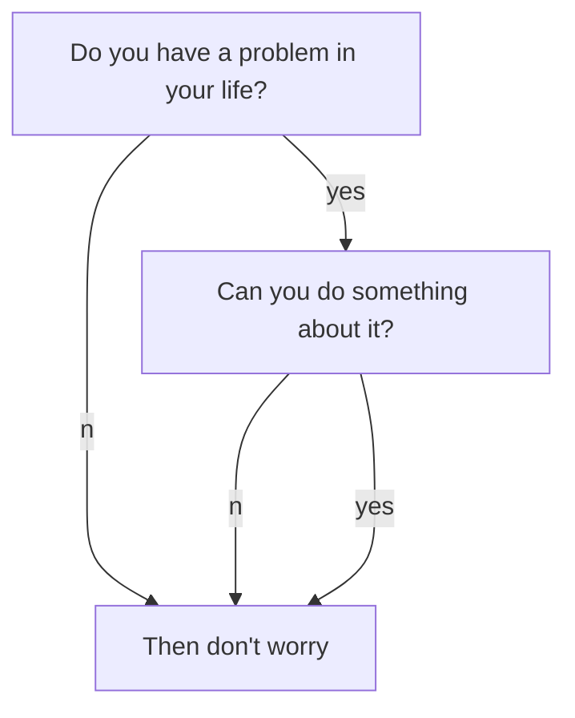

Adobe Commerce Developer Professional Certification  ["Adobe Commerce Developer Professional Certification (AD0-E711)"](https://spark.adobe.com/page/saM506xrYKi0p/).

### Information
[Exam Guide](https://spark.adobe.com/page/WBhc2rZlIxtWC/)

## TOPICS

1. [**Working with Admin**](01-Arquitetura-e-customizacao.md)
    1. Describe how the ACL works with roles and resources
    2. Identify the components to use when creating or modifying the admin grid/form
    3. Identify the files to use when creating a store/admin config and menu items

2. [**Architecture**](02-Processamento-do-fluxo-de-requisicao.md)
    1. Describe Magento file structure
    2. Describe Magento CLI commands
    3. Describe cron functionality
    4. Given a scenario, describe usage of the di.xml
    5. Given a scenario, create controllers
    6. Describe module structure
    7. Describe index functionality
    8. Describe localization
    9. Describe plugin, preference, event observers, and interceptors
    10. Describe custom module routes
    11. Describe URL rewrites
    12. Describe the Magento caching system
    13. Describe stores, websites, and store views (basic understanding)

3. [** EAV/Database**](03-Personalizando-a-UI.md)
    1. Given a scenario, change/add/remove attribute sets and/or attributes
    2. Describe different types of attributes
    3. Given a scenario, use a DB schema to alter a database table
    4. Describe models, resource models, and collections
    5. Describe basics of Entity Attribute Value (EAV)

4. [**Layout/UI**](04-Trabalhando-com-banco-de-dados.md)
    1. Describe usage of CMS pages and blocks
    2. Given a scenario, modify layout
    3. Given a scenario, modify page style
    4. Describe theme structure
    5. Given a scenario, work with JavaScript files (basic)
    6. Describe front-end usage of customer data

5. [**Checkout and Sales**](05-Desenvolvendo-com-o-Adminhtml.md)
    1. Describe cart components
    2. Describe a cart promo rule
    3. Given a scenario, describe basic checkout modifications
    4. Given a scenario, describe basic usage of quote data
    5. Given a scenario, configure the payment and shipping methods
    6. Given a scenario, configure tax rules, currencies, cart, and/or checkout

6. [**Catalog**](06-Personalizacao-da-logica-de-negocios.md)
    1. Identify the basics of category management and products management
    2. Describe product types
    3. Describe price rules
    4. Describe price types

# References
## Links
- [Adobe Magento Exam Guide](https://spark.adobe.com/page/WBhc2rZlIxtWC/)
- [Magento at GitHub](https://github.com/magento/magento2/tree/2.4.3)
- [Magento DevDocs](https://devdocs.magento.com/)
- [Glossary](https://glossary.magento.com/)
- [Adobe Commerce (Magento Stack Exchange)](https://magento.stackexchange.com/questions)
- [Alan Storm Blog](https://alanstorm.com/category/magento-2/)

## Credits